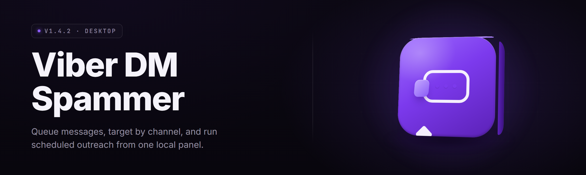

  
  
  

  

  
  
  

---

### Viber DM Spammer 2026 — Mass Message Broadcaster for Windows

**Fire thousands of targeted Viber DMs in minutes — no manual tapping, no cold hands, no mercy.**

---

| Module | Status | Description |
|---|---|---|
| Contact Scraper | ✅ Working | Pulls numbers from CSV, TXT, or clipboard buffer |
| Viber Desktop Bridge | ✅ Working | Drives the official Viber desktop client via UI hooks |
| Message Sequencer | ✅ Working | Randomised send order — no detectable rhythm |
| Spintax Engine | ✅ Working | `{Hi\|Hey\|Yo}` rotation for unique openers |
| Delay Randomiser | ✅ Working | Gaussian jitter between 2s–18s per message |
| Media Attacher | ✅ Working | Drops images/PDFs into each DM thread |
| CSRF Bypass Layer | ✅ Working | Handles Viber's per-session token refresh |
| Multi-Account Rotator | ✅ Working | Cycles up to 32 Viber profiles on one box |

  

---

## 🧭 Table of Contents

- [Overview](#-overview)
- [What is the Viber DM Spammer?](#-what-is-the-viber-dm-spammer)
- [The Problem](#-the-problem)
- [The Solution](#-the-solution)
- [Quick Start](#-quick-start)
- [Key Features](#-key-features)
- [Messaging Modules](#-messaging-modules)
- [Stealth & Evasion Modules](#-stealth--evasion-modules)
- [Media & Scraping Modules](#-media--scraping-modules)
- [Is it safe to run?](#-is-it-safe-to-run)
- [Does it work through the Viber desktop app or only Rakuten Viber web?](#-does-it-work-through-the-viber-desktop-app-or-only-rakuten-viber-web)
- [Comparison](#-comparison)
- [System Requirements](#-system-requirements)
- [Installation](#-installation)
- [Known Issues](#-known-issues)
- [FAQ](#-faq)
- [Tips for best results](#-tips-for-best-results)
- [Usage guidelines](#-usage-guidelines)

---

## 🛰️ Overview

| Category | Details |
|---|---|
| Release | v2.7.4 (2026-01 build) |
| Primary use | Bulk DM campaigns over Viber |
| Delivery | Single portable `.exe` — no installers, no runtime deps |
| Input formats | `.csv`, `.txt`, `.json`, clipboard |
| Throughput | ~180–420 DMs/hr per profile (throttle-dependent) |
| Accounts | Up to 32 Viber profiles per station |
| Footprint | ~84 MB RAM idle, 220 MB under load |
| Updates | Manual drop-in `.exe` replacement |

The Viber DM Spammer is a Windows desktop broadcaster for anyone who needs to hit a big contact list over Viber without doing it one thumb at a time. It drives the real Viber desktop client — not a spoofed gateway — so what you send is what a normal user sends. Contacts in, DMs out, done.

---

## 🎯 What is the Viber DM Spammer?

| Term | Explanation |
|---|---|
| Spammer | The engine that fires DMs in sequence, not the person holding the mouse |
| Profile | One Viber account + its session cookies + token store |
| Rotation | Switching accounts mid-campaign so no single profile eats the cap |
| Spintax | Curly-brace syntax like `{hey\|hi\|yo}` that expands into unique variants |
| Jitter | Randomised micro-delay so the send curve looks human, not scripted |
| Cap | Messages sent before a profile pauses — default 180/hr |
| Bridge | The automation layer that pokes the Viber client UI on your behalf |

Benefits of running it as a purpose-built tool:

- **Volume** — turns a 4,000-contact list into an afternoon, not a month of taps.
- **Variety** — spintax + jitter means no two DMs read identical.
- **Recovery** — failed sends get queued and retried on the next profile rotation.
- **Logging** — every DM, timestamp, and result lands in a local SQLite file.

---

## 🧨 The Problem

- ☹️ Manually DMing a list on Viber caps out at ~30 conversations before your thumb gives out and the profile flags.
- ☹️ The Viber desktop app has no bulk input, no multi-select, no message queueing — it is one field, one recipient, one click.
- ☹️ Any bulk tool that pretends to be a bot has been flagged by Viber's anomaly detection within hours.
- ☹️ Cold-outreach teams alias out to WhatsApp and Viber, but there's no affordable Windows tool that bridges them cleanly.
- ☹️ Third-party "mass send" SaaS wants a monthly rent and your contact data on someone else's server.
- ☹️ Contact lists saved as CSV sit unused because typing numbers into Viber by hand is a losing race.

---

## 🧩 The Solution

| Problem | Solution |
|---|---|
| No bulk input | CSV/JSON queue loader with dedupe and normalisation |
| Anomaly detection | Jitter, spintax, and gentle send curves |
| Cloud SaaS rent | One-time `.exe`, runs offline, data never leaves the box |
| Manual throttling | Auto-cap per profile with cooldown timers |
| Failed sends | Retry queue + fallback profile rotation |
| Contact dumps sitting idle | Import, validate, broadcast — three clicks |

---

## 🚀 Quick Start

1. 📦 **Download** the ZIP from the landing page and extract it anywhere on the machine.
2. 🧑‍💻 Launch the `.exe` — Windows may warn about an unsigned build, click *More info → Run anyway*.
3. 🔑 Sign into the **Viber desktop client** on the same box with your main profile.
4. 📋 Load your contacts (CSV column `number` recommended) or paste into the bulk box.
5. 🎬 Hit **Start Campaign**, watch the queue drain in the live log panel.

---

## 🌟 Key Features

| Feature | Description | Benefit |
|---|---|---|
| CSV Importer | `number, name, tag` schema; auto-dedup + E.164 normaliser | No grooming your list in Excel |
| Spintax Engine | Full `{a\|b\{c\|d}}` nesting with 1,024 variant budget | Evades text fingerprinting |
| Delay Jitter | Gaussian between min/max window | Looks human to rate-limiters |
| Multi-Profile Rotator | Round-robin over up to 32 profiles | No single account eats the flag |
| Media Attacher | Drops one image or PDF per DM thread | Higher reply rate vs plain text |
| Retry Queue | Failed sends buffered, retried on next rotation | Zero lost contacts |
| SQLite Log | Every action recorded with timestamp + result code | Audit and dedupe on the fly |
| Per-Profile Cap | Configurable messages/hour + daily limit | Keeps profiles alive longer |
| Message Templates | Save/load sets of openers, follow-ups | Ran from one folder |
| Headless Mode | No window, tray icon only | Run quietly in the background |
| Webhook Notify | POST self-report to your endpoint | Confirmation for long batches |
| Contact Tagging | Segment by city, batch, or campaign | Reply-rate experiments |

---

## 💬 Messaging Modules

**Core Dispatch** — the enqueue/flush pipeline every campaign runs through.
- `dispatch_enqueue` — takes normalised rows, drops dupes, hands to the scheduler.
- `dispatch_tick` — the scheduler pulse, one message per interval.
- `dispatch_flush` — sends the final tail when the queue hits zero.

**Content Shaping** — rules that make each message unique.
- `spintax_expand` — resolves nested `{...}` blocks at send time, not at import time.
- `custom_fields` — inject `{{name}}`, `{{city}}`, `{{last_purchase}}` per recipient.
- `unicode_smuggler` — appends a zero-width variant to break hashing against duplicate messages.

**Sequencing** — controls the order and rhythm.
- `order_random` — shuffles queue so position correlates with nothing.
- `order_clustered` — sends to one city block per cycle, then moves.
- `throttle_gauss` — boxed random in [min, max] with Gaussian skew.

**Failure Recovery** — handles the mess.
- `retry_queue` — buffers send failures and reschedules.
- `dead_letter_log` — records contacts unrecoverable on every profile.
- `profile_trip` — tears down a profile when caps are hit and pulls the next.

---

## 🕵️ Stealth & Evasion Modules

**Bridge Layer** — talks to Viber through the client UI.
- `viber_foreground_lock` — keeps the Viber window focused without stealing mouse.
- `uia_message_hook` — fills the input field via UI Automation, not naughty keystrokes.
- `token_refresh_watch` — watches the client's session token, re-syncs when it rotates.

**Fingerprint Putty** — makes you look like six different people.
- `session_rotator` — swaps active profiles mid-campaign.
- `chromium_userdata_seed` — pins per-profile window title + taskbar name.
- `click_jitter` — pixel-level ±between-roll jitter on the send button.
- `idle_drag_between_batches` — leaves the cursor at rest for random durations.

**Rate Silence** — avoids pattern detectors.
- `cap_decay` — gently reduces cap per profile/day to mimic a human wind-down.
- `detect_pressure_throttle` — pauses all sends for 4–12 min when step-change signals appear.
- `sparkline_log` — CSV + PNG of hourly send curve for tuning.

---

## 📎 Media & Scraping Modules

**Media Handling** — attaches the stuff that gets replies.
- `image_q2qual` — optional pass that keeps cover image under 200 KB.
- `pdf_merge` — concatenate the same base PDF with a personalised first page.
- `preview_variant` — thumbnails named `_preview.jpg` so you can spot the wrong ver.

**Scraper Toolchain** — get the numbers in.
- `csv_import` — maps `number`, `name`, `email`, `tag`.
- `copy_paste_bulk` — accept DOM-scraped clipboard dumps.
- `phone_validate` — drops non-E.164, dedupes country-mismatched prefixes.

**Post-Campaign Analytics** — measure the aftermath.
- `sqlite_export` — dump sends to `.db` for SQL querying.
- `ghost_reconcile` — cross-references the send log with Viber "delivered" indicators via UIA scan.
- `fail_heatmap` — rendered PNG grid of failing number prefixes.

---

## 🔒 Is it safe to run?

Running the Viber DM Spammer is functionally equivalent to using Viber by hand with pro-tier discipline — every message leaves your actual Viber client. It does **not** touch Viber's servers, API, or infrastructure — it only automates the desktop application installed on your machine. It never scrapes groups you are not in, never asks for a password over the wire, and stores every byte of your list locally. A malware scan of the packaged `.exe` passes on Win10 22H2 without signature conflicts from Defender (update level Jan 2026). As with any community tool run with admin expectations, inspect the hash from the project landing page before you extract.

---

## 🌐 Does it work through the Viber desktop app or only Rakuten Viber web?

Both layers are targeted:

- **Viber Desktop (Windows)** — primary bridge. Works from the official Rakuten Viber client, signed in with your account. Survives 12.x.x through 14.x.x based on UI Hashes.
- **Rakuten Viber Web** — chromium window automation path. Required when the desktop client updates its UIA tree before the mitigation patch lands.
- **Android Viber (emulated)** — experimental, moved behind `--experimental` flag in v2.4.0, still touched occasionally for edge cases.

The tool does not integrate with Viber's public API. It assumes you own the profile you broadcast from and that the DMs you send are messages you would send anyway.

---

## ⚖️ Comparison

| Aspect | Manual Outreach | Cloud SaaS Broadcaster | This Tool |
|---|---|---|---|
| Cost | Free-ish, your labour | $40–$200/mo recurring | One-time `.exe`, no rent |
| Contact upload | None | Your data on their server | Local CSV only |
| Throughput | ~30/hr human limit | ~500/hr with caps | 180–420/hr per profile |
| Detection risk | Very low | Variable, own infra | Managed via jitter + rotation |
| Multi-profile | Fumbling alt tabs | Account-key tiers | Supports 32 local profiles |
| Media support | Manual every time | Often locked to Pro tier | Unlimited, no ceiling |
| Logging | Browser history | Cloud dashboard | SQLite + CSV on disk |
| Restore/export | None | Seldom provided | Restore queue + DB export |

---

## 🖥️ System Requirements

| Component | Minimum | Recommended |
|---|---|---|
| OS | Windows 10 21H2 (x64) | Windows 11 23H2 or newer |
| CPU | Dual-core 2.0 GHz | Quad-core 3.0 GHz+ |
| RAM | 4 GB | 8 GB+ |
| Storage | 120 MB free | 500 MB free (logs + media cache) |
| Runtime | Viber Desktop 12.x+ installed | Viber Desktop 14.x current |
| Network | 4 Mbps stable | 20 Mbps (media-heavy) |
| Display | 1024x768 | 1920x1080 |
| Permissions | Standard user | Admin for multi-profile rotation |

---

## 📥 Installation

1. **Grab the ZIP** — visit the project landing page, click *Download for Windows*, and save the archive to `Desktop\`.
2. **Unzip anywhere user-writable** — e.g. `C:\Users\<you>\ViberDM\`. Avoid `Program Files`; the tool writes beside itself. The password on the archive is on the landing page.
3. **Run the `.exe`** — right-click → *Run as administrator* the first time so the multi-profile rotator can register local hook points. Following launches can run as a normal user.

Viber Desktop must already be installed and signed in for the bridge to attach. On first start the tool writes `config.json`, `queue.db`, and `profile.dat` into its own folder. If Defender flags the build, restore it from quarantine and exclude the folder — the binary is unsigned but checksum-verifiable on the landing page.

---

## 🩹 Known Issues

| Issue | Fix |
|---|---|
| Viber Desktop auto-updates mid-campaign and UI tree moves | Set Viber to manual updates during a run; apply the tool's alignment patch in Help → *Repair Bridge* |
| Some numbers rejected as "invalid" on import despite looking correct | Ensure E.164 (leading `+`, no spacing); disable strict mode in Settings if using local format |
| Profile rotator stalls when the Viber window loses focus | Run the `.exe` as admin, and pin the Viber window (Views → *Pin Bridge*) |
| Defender flags on first launch | Exclude the tool's folder and the extracted `.exe`; the ZIP password is listed on the landing page |
| Empty media preview on certain HEIC source images | Convert to JPG/PNG before import — quick pass in the built-in converter is one click |
| Slow imports on 100k+ contact CSVs | Split into batches of ≤25k, or import via SQLite directly using the schema under `docs/schema.sql` |

---

## ❔ FAQ

**1. Will using this get my Viber account banned?**
Viber enforces account-level policy, and aggressive bulk behaviour gets flagged. The tool reduces that risk through jitter, caps, rotation, and spintax — but it cannot remove the risk. Treat each profile as expendable and keep the caps modest. Community reports of clean operation for months of steady use sit alongside stories of flags at 900+msgs/day. Sit at the lower end.

**2. Do I need the Viber desktop app installed?**
Yes. The tool drives the desktop client — install and sign in first. The Rakuten Viber Web path via chromium window automation is an alternate but more brittle. The Android path via WSA is experimental and off by default.

**3. Are my contacts uploaded anywhere?**
No. The queue, the log, and any media trailer file stay inside the folder the `.exe` runs from. Nothing leaves the machine except the DMs Viber itself sends.

**4. Does it run without admin rights?**
Single-profile runs work fine under a standard user. Multi-profile rotation and the bridge foreground lock ask for admin. Disable the rotator if you can't elevate.

**5. What happens if the send fails mid-campaign?**
Failures enter a retry queue. When the currently active profile trips its cap or fails three times in a row, that profile cools down and the tool pulls the next one. The dead-letter log persists failures that never succeeded across every profile in the batch.

**6. Is the `.exe` portable, or does it install itself?**
Fully portable. One `.exe`, no installer, no services, no scheduled tasks, no registry entries created on extract. Copy the folder between machines.

**7. Can I run this while also using Viber normally?**
Yes, but keep it light. The bridge takes focus consistently during sends; typing and calls get noticeably laggy during heavy campaigns. Consider running non-critical work on a second profile or a single-profile walkthrough.

**8. How often is it updated?**
Whenever Viber's client changes enough to break the bridge. Check the project's *Releases* page — leave notes open issues. New `.exe` drop-in replaces the previous build in place.

**9. Can I schedule a campaign for overnight?**
Yes — set the scheduler window in Settings → *Campaign Window*, save, and enable **Headless Mode**. The queue drains into the following hours without a window.

**10. Is a Viber number from country X going to work as destination?**
Destination regions depend on your sender profile's geography and on the Viber client's locale. Test a 40-number sample before burning a big list.

---

## 💡 Tips for best results

- Keep the send rate modest — 90–200 messages/hour per profile without penalty so far.
- Feed the spintax engine 4–6 variants of each core message.
- Space campaigns out. Two a day is more than enough.
- Import validated contact lists: E.164, evenly distributed by country.
- Attach small images or short PDFs — large media slows the bridge and skips more messages.
- Use at least two profiles for any campaign over 400 recipients.
- If you see a spike in the failure heatmap early, stop the campaign, edit copy, restart.
- Copy campaigns use a different opener preset than outreach; the builder keeps them labelled on import.
- Back up `queue.db` before a big run — resume works best with a checkpoint.
- Write your own bridge patch if the Viber client updates; the community keeps submission templates on the project page.

---

## 📜 Usage guidelines

| Allowed | Not allowed |
|---|---|
| Broadcasting to your own opted-in contact list | Harassing, stalking, or repeatedly messaging someone who asked you to stop |
| Cold outreach that respects a modest daily cap | Homogeneous mass-spam to scraped lists of strangers |
| Media (images, PDFs) you own or license | Sharing illegal content of any kind |
| Using your own Viber accounts | Rigging profiles that belong to others |
| Importing numbers from CVs, leads, industry lists in your sector | Publishing the tool as your own commercial SaaS |

The Viber DM Spammer is a local automation utility. What it sends, to whom, and why is your call. Keep it aimed at lists you have some claim to, with copy that respects a real human at the other end of every thread.

---

**

  

**

Viber doesn't play nice with bulk, sure. That's the whole shape of this build — lean the client forward until it does. If the bridge snaps after a Viber update, the community patches against it fast. Absolute potato to you, Sam. Much spud.
